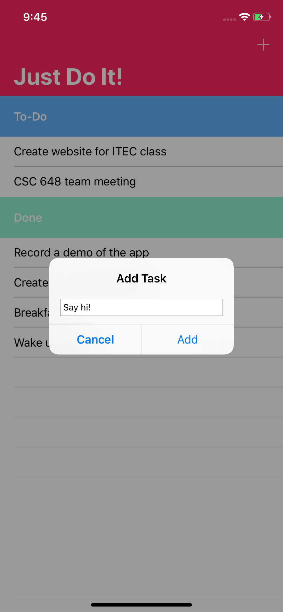
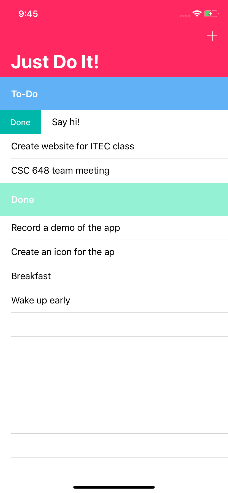
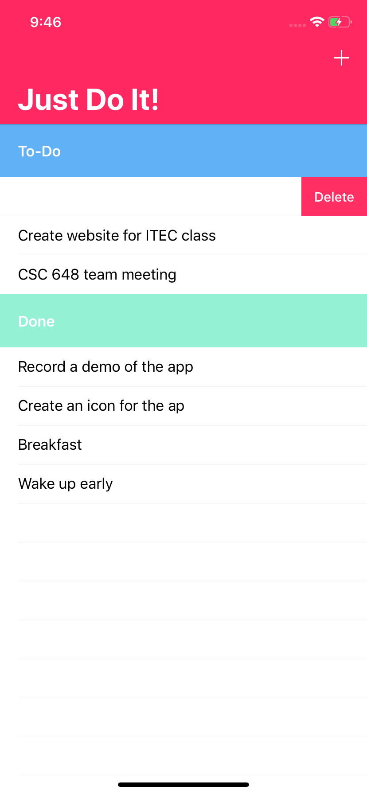

# Just Do It! Basic Todo app, CSC 690 Assignment 2.

<p align="center">
  <a href="https://github.com/jkhusanov/just-do-it">
    
  </a>
</p>

<h3 align="center">
  Just Do It
</h3>

<p align="center">
  Todo app
</p>

## Preview


|                                             |                                             |                                             |
| :-----------------------------------------: | :-----------------------------------------: | :-----------------------------------------: |
|  |  |  |

## TODO

- [x] Setup the project
- [x] Extended navigation bar
- [x] Add customized sections with dummy data
- [x] Add Alert for user input
- [x] Create tasks dynamically
- [x] Implement saving tasks with UserDefaults
- [x] Create an app icon and add it
- [x] App wrap-up and demo

## Getting started

**For full and better experience use real device, or test saving feature by closing the app manually and reopening**

```
git clone https://github.com/jkhusanov/just-do-it.git

cd just-do-it

xed .
```

## Feedback

In case you have any feedback or questions, feel free to open a new issues on this repo or reach out to me [**@jkhusanov**](https://github.com/jkhusanov) on Github.
